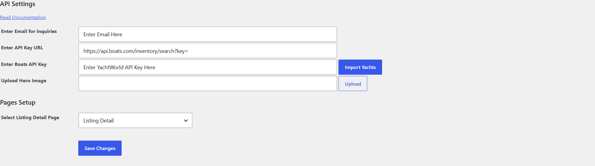
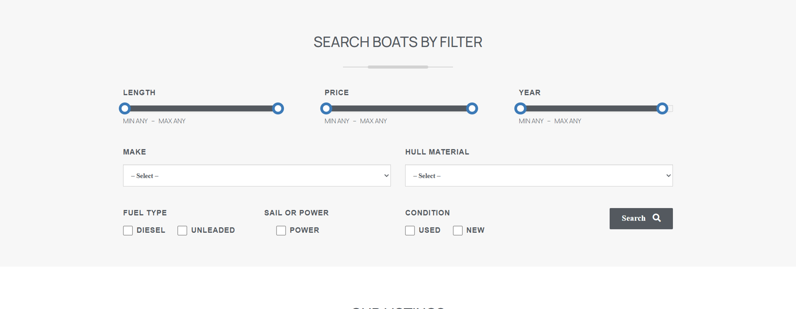
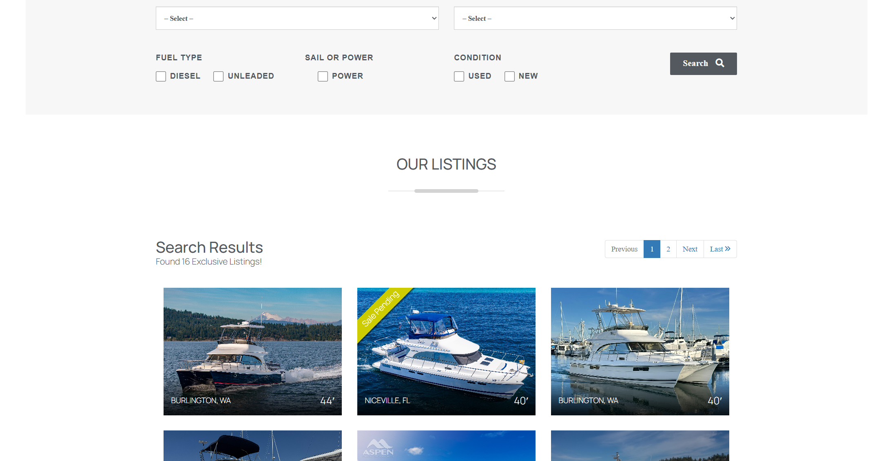
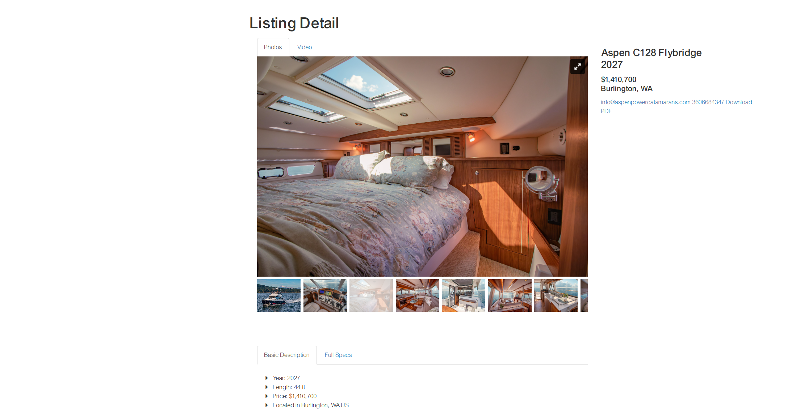

# Yacht Importer

WordPress plugin that imports YachtWorld listings into a filterable grid on your site.

Version 1.6.1 does not ask for an activation key. Each site still needs its own YachtWorld / Boats API URL and API key.

## What it does

- Imports active, on-order, and sale-pending boats from the Boats API.
- Refreshes that inventory about every 6 hours after the plugin is activated from the Plugins screen.
- Shows a search form and listing grid on a page.
- Opens each boat on a detail page with photos, specs, and an inquiry form.
- Lets you link to a filtered set of results by copying the URL after a search.
- Lets a shortcode open with filters already applied.

An import replaces the inventory already stored by the plugin. It does not create a WordPress post for each boat.

## Install

1. Download this repository and install it like any other plugin. The plugin folder is `yachtsboatsapi`, and the main file is `boatsapi.php`. In wp-admin, use **Plugins → Add New → Upload Plugin**.
2. Activate **Yacht Importer** from the Plugins screen.

## Settings

Go to **Settings → Yacht Importer**.



1. **Email for inquiries.** Inquiry notifications are sent to this address. The visitor also receives a copy.
2. **API Key URL.** Use a URL that ends with `key=`, for example `https://api.boats.com/inventory/search?key=`. The plugin adds the API key to the end of this URL.
3. **Boats API Key.** The key issued for that Boats API account. Enter it in this field only. Do not paste the key into the URL field.
4. **Hero image.** Optional.
5. **Select Listing Detail Page.** Choose the detail page created below.
6. Click **Save Changes**. Save before the first import. The import reads the saved settings.
7. Click **Import Yachts**.

To pull a change immediately, use **Import Yachts** again. Otherwise the scheduled import runs about every 6 hours.

## Pages

Create two pages and publish them.

1. A search page, for example “Yacht Search”. In the page template list, choose **Yacht Plugin Template**. Add the page to your menu if visitors should be able to find it.
2. A detail page, for example “Yacht Detail”. Choose **Yacht Detail Plugin Template**.

Then return to **Settings → Yacht Importer**, set **Select Listing Detail Page** to the Yacht Detail page, and click **Save Changes**. Listing cards link to that page and pass `boat_id` in the URL. Without this selection, those links have nowhere to go.

On a block theme, those two templates appear with the theme’s page templates. If they are not listed, use the shortcode below on the search page and keep the detail page selected in the plugin settings.

## Shortcode

Put this on any page, post, or shortcode block to show the same search filters and listings:

```
[yacht-listings]
```

In a PHP template:

```php
echo do_shortcode('[yacht-listings]');
```

If you use the shortcode instead of **Yacht Plugin Template**, you still need the Yacht Detail page selected in the plugin settings.

The shortcode renders the filter panel, the search, and a paginated grid.





The detail template can also be placed with:

```
[yacht_detail_shortcode]
```

That page must be opened with `?boat_id=` set to a boat id from the imported inventory.

### Preset filters

Shortcode attributes apply filters when the page loads. Matching checkboxes are already selected, and the grid is filtered without clicking **Search**. A normal search still works after that. Values that are not in the imported inventory are ignored.

| Attribute | What it filters | Example values |
| --- | --- | --- |
| `type` | Sail or power | `Power`, `Sail` |
| `fuel` | Fuel type | `diesel`, `unleaded` |
| `condition` | Boat condition | `Used`, `New` |

Values are case-sensitive and must match the codes stored by the import. Separate multiple values with a comma, with no extra spaces.

Show only power boats:

```
[yacht-listings type="Power"]
```

Show diesel boats:

```
[yacht-listings fuel="diesel"]
```

Combine filters:

```
[yacht-listings type="Power" fuel="diesel" condition="Used"]
```

More than one value for the same filter:

```
[yacht-listings fuel="diesel,unleaded"]
```

If the page URL also has filters, the URL wins. The shortcode attributes are only the defaults. For example, `[yacht-listings type="Power"]` on a URL that contains `type[]=Sail` shows the sail results from the URL.

These attributes were added in 1.5.4. Existing pages that use `[yacht-listings]` without attributes keep the same search behavior.

## Filtered links

The grid shows nine boats per page. Filters cover length, price, year, make, hull material, fuel type, sail or power, and condition.

To link to a specific result set:

1. Open the search page.
2. Set the filters and click **Search**.
3. Copy the URL from the browser.
4. Use that URL in a menu, page, post, or message.

The search adds `resultButton` and the filter fields to the query string. Sharing that full URL opens the same results.

## Detail page

Each listing links to the detail page with that boat’s id. The page shows the photo gallery, year, length, price, location, hull, engine and fuel, description, and specs that came back from YachtWorld. It also shows the listing broker’s email and phone when the API included them.



The inquiry form on that page emails the address saved under **Email for inquiries**, and sends a copy to the visitor.
